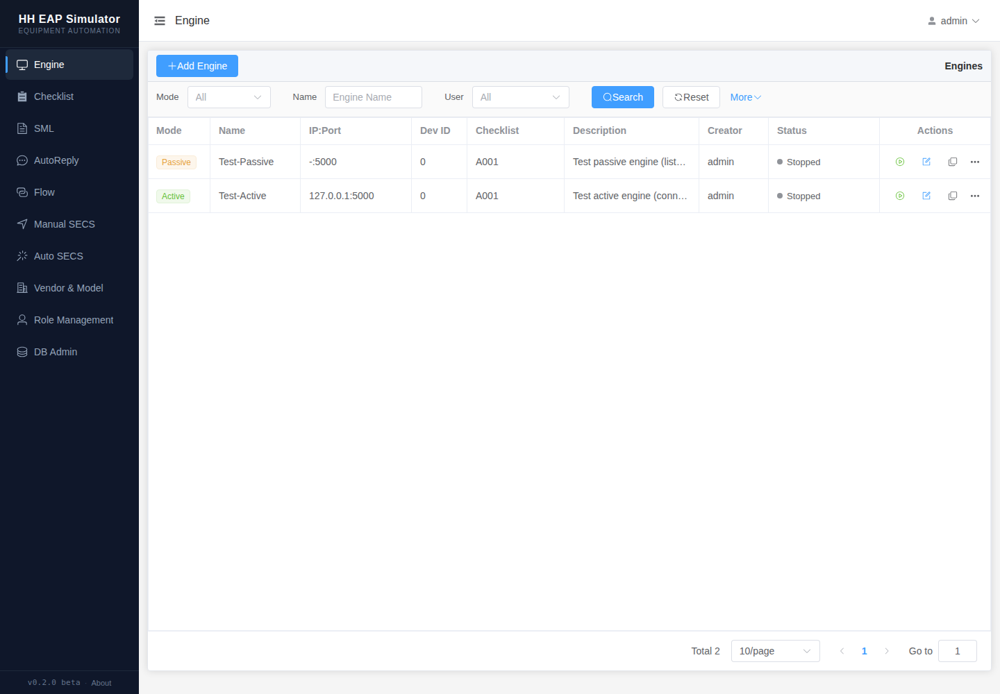
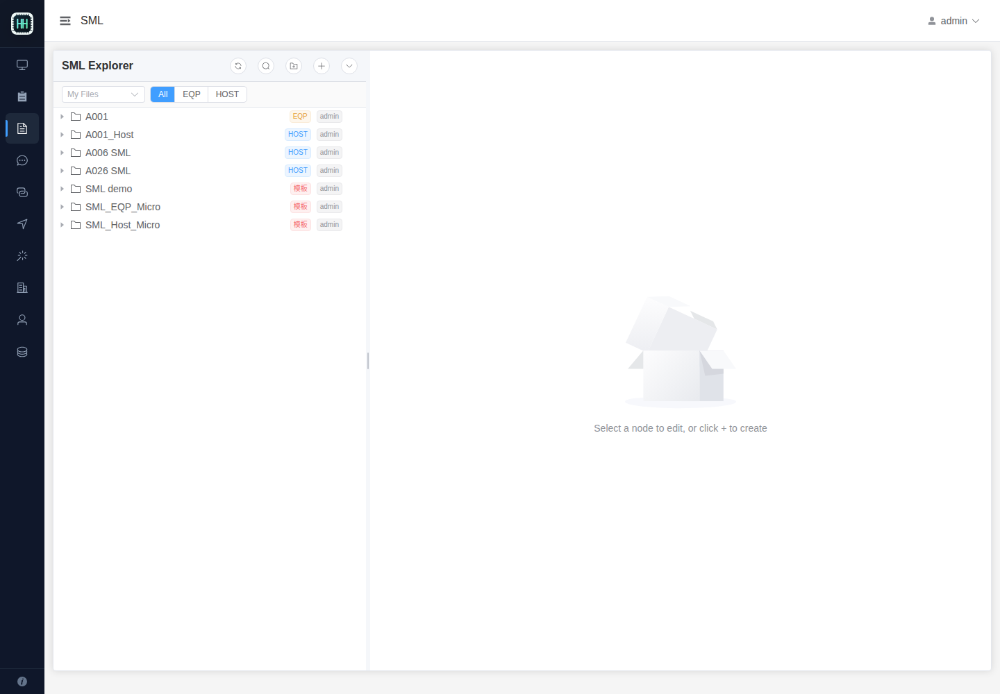
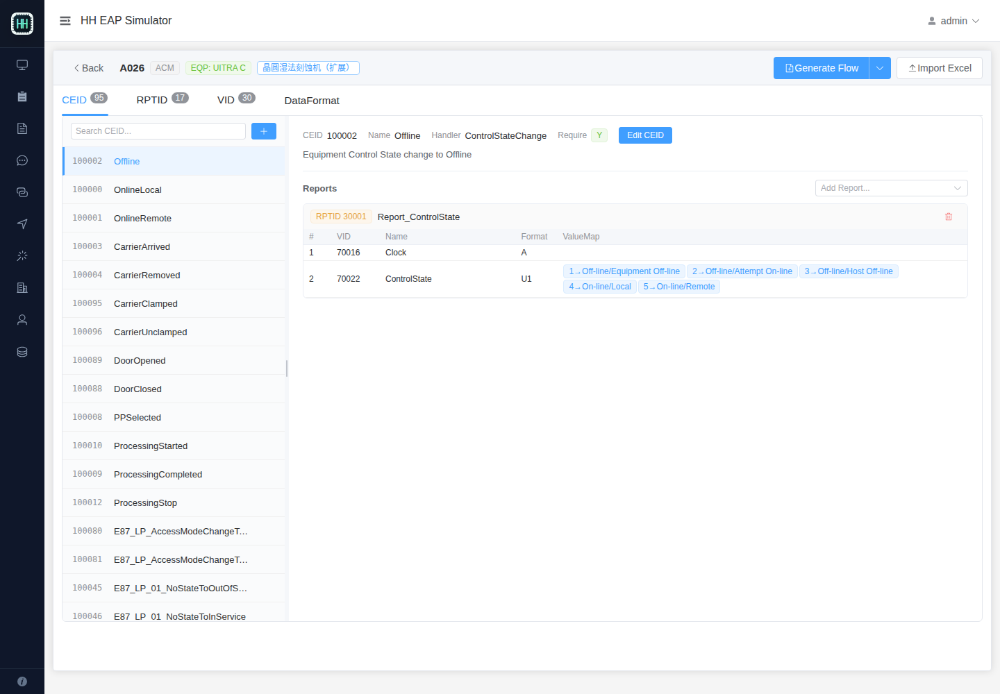
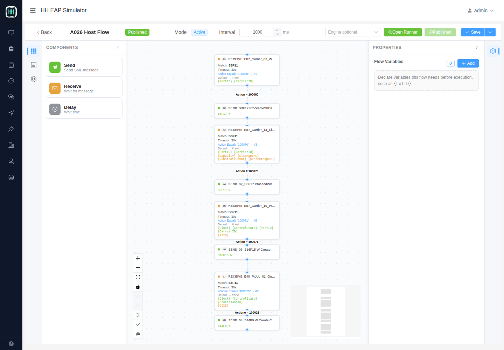
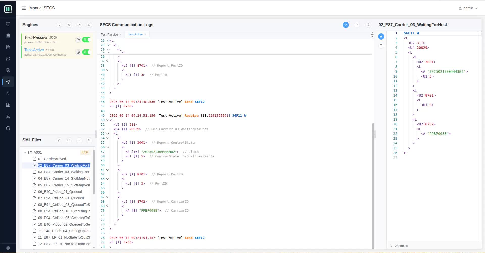
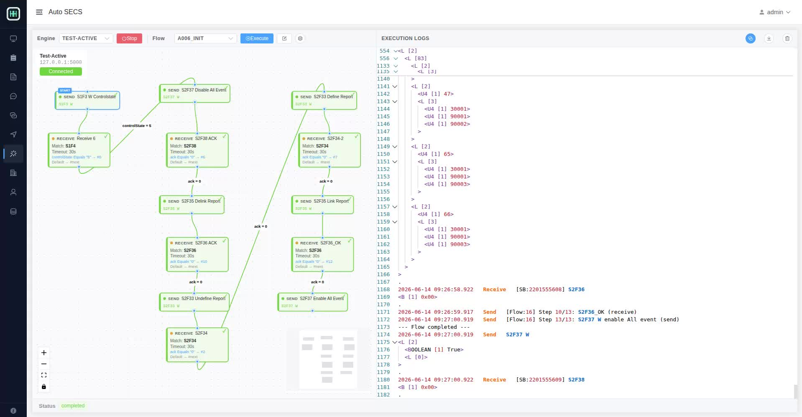

# HH EAP Simulator Web UI

HH EAP Simulator Web UI 是半导体设备自动化模拟系统的前端界面。它面向 SECS/GEM、HSMS、EAP 联调场景，提供设备连接管理、SML 报文维护、手动收发、自动回复、可视化 Flow 编排，以及 Checklist 驱动的 SML/Flow 生成能力。

本仓库只包含前端源码。后端服务、数据库、迁移脚本、种子数据和完整发布包由主项目单独维护。

## 项目特色

- **面向半导体 EAP 场景**：围绕 HSMS 连接、SECS/GEM 报文、SML 文件、VID/RPTID/CEID Checklist 建模。
- **可视化 Flow 编排**：通过图形节点配置 Send、Receive、Delay、Function 步骤，支持规则跳转、变量提取、固定变量和运行器调试。
- **灵活变量体系**：Flow 可以声明运行前需要输入的变量，也可以从 Receive 节点收到的报文中按路径提取变量，或通过 JavaScript/TypeScript 函数计算生成新的变量。
- **Checklist 驱动生成**：从设备 Checklist 生成 Dynamic Report SML，也可以基于 Flow Template 生成特定设备的 Flow。
- **Manual SECS 工作台**：同一页面完成 Engine 选择、SML 文件浏览、报文内容查看、发送和日志观察。
- **模板化复用**：Flow 可以保存为 Flow Template，并在不同 checklist 下复用，自动绑定 checklist 中的事件和变量定义。


## 界面预览

### Engine 管理

维护主动/被动 HSMS Engine、IP/端口、Device ID、关联 Checklist，并查看运行状态。



### SML 文件库

以树形结构管理 SML 文件夹和报文内容，可用于手动发送、自动回复和 Flow Send 节点。



### Checklist 配置

维护设备的 CEID、RPTID、VID、Data Format 和 ValueMap，并可一键生成 SML 或 Flow。



### Flow 图形编辑器

通过节点图配置自动化流程，支持规则连线、Receive 变量提取、Flow Variables、运行器和 Checklist Binding。



### Manual SECS

面向调试人员的手动 SECS 工作台：左侧选择 Engine 和 SML 文件，中间查看通信日志，右侧查看或编辑 SML 内容。



### Auto SECS

选择 Engine 和 Flow 后执行自动化流程，实时展示 Flow 节点执行状态、SECS 收发日志和 SML 明细，适合初始化、Dynamic Report 配置和设备联调回放。




## 核心功能

### Engine

- 新增、编辑、启动、停止 HSMS Engine。
- 支持 active/passive 两种连接模式。
- 显示运行态、连接态、Device ID、关联 Checklist 和创建者。

### SML

- 按文件夹管理 SML 报文。
- 支持模板文件夹、Host/EQP 类型标记。
- 可被 Manual SECS、AutoReply 和 Flow 复用。

### Manual SECS

- 选择 Engine 后发送 SML。
- 订阅实时日志和收发记录。
- 支持 Engine 搜索、SML 文件搜索和三栏工作区。

### Auto SECS

- 选择已发布 Flow 并绑定 Engine 执行。
- 在图形区跟踪节点执行状态。
- 在日志区查看完整 SECS 收发记录和 Flow 步骤结果。

### AutoReply

- 配置收到特定 SxFy 后的自动回复规则。
- 支持变量路径提取和条件匹配。
- 适合模拟设备侧或 Host 侧的标准应答行为。

### Flow

- 图形化编排 Send、Receive、Delay、Function 节点。
- 支持 Flow Variables，在执行 Flow 前声明必填变量和默认值。
- Receive 节点可以从收到的 SECS 报文中按 index path 提取变量，例如 CarrierID、PortID、ACK 等。
- Function 节点和计算变量可以通过 JavaScript/TypeScript 函数从已有变量、报文内容或函数返回值生成新变量。
- Send 节点可以使用 `{VariableName}` 占位符，把变量带入 SML 报文。
- 支持固定值/默认值变量，适合批量复用同一套 Flow。
- Receive 节点支持变量提取、计算变量和规则跳转。
- Flow Run 页面支持执行前变量赋值。
- Flow Template 可与 Checklist Binding 结合，为不同设备生成对应 Flow。

### Checklist

- 维护 CEID/RPTID/VID 的映射关系。
- 支持导入 Excel。
- 根据 Checklist 生成 Dynamic Report 相关 SML。
- 根据 Checklist + Flow Template 生成设备专属 Flow，例如 `A029_HOST`、`A029_INIT`。

## 简单使用说明

1. 打开系统地址并登录。
2. 在 Engine 页面配置或启动 HSMS 连接。
3. 在 SML 页面维护常用 SECS 报文。
4. 在 Manual SECS 页面选择 Engine 和 SML 进行手动调试。
5. 在 Checklist 页面导入或维护 CEID/RPTID/VID 定义。
6. 在 Flow 页面创建或编辑自动化流程，也可以从 Checklist + Flow Template 生成设备专属 Flow。
7. 在 Auto SECS 页面选择 Engine 和已发布 Flow 执行自动化测试。

开发数据库通常包含默认账号，具体账号以后端种子数据为准：

```text
admin / eap123456
```

## 开发文档

本地开发、环境变量、常用命令、技术栈和仓库边界请参考 [DEVELOPER.md](DEVELOPER.md)。

## License

The frontend source code and frontend documentation in this repository are licensed under the MIT License. Backend source code, prebuilt backend binaries, application distributions, database migrations, seed datasets, and checklist templates are excluded and require separate distribution terms.
